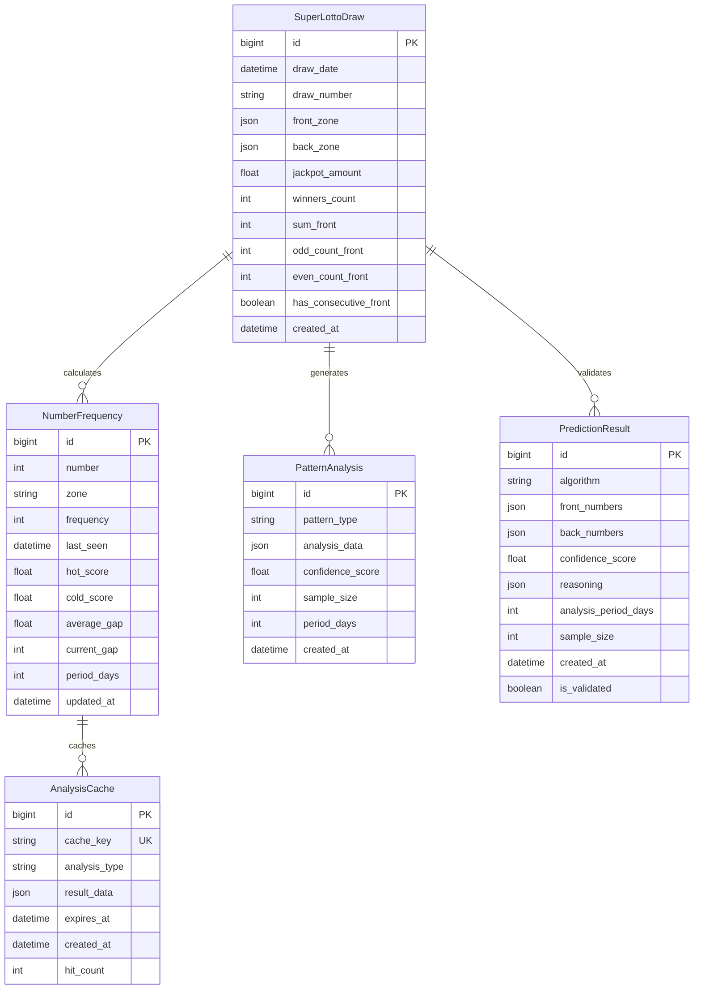

# Data Model: 大乐透彩票预测功能

**Feature Branch**: `001-super-lotto-prediction`
**Date**: 2025-11-21
**Database**: SQLite with SQLx
**Framework**: Rust + Tauri 2 + Vue 3

## Entity Overview

### Core Entities

1. **SuperLottoDraw** - Historical lottery drawing data
2. **NumberFrequency** - Frequency statistics for each number
3. **PatternAnalysis** - Pattern detection results
4. **PredictionResult** - Generated predictions with confidence scores
5. **AnalysisCache** - Cached analysis results for performance

## Entity Definitions

### 1. SuperLottoDraw

Represents a single Super Lotto drawing result.

```rust
#[derive(Debug, Clone, Serialize, Deserialize, FromRow)]
pub struct SuperLottoDraw {
    pub id: i64,
    pub draw_date: chrono::DateTime<chrono::Utc>,
    pub draw_number: Option<String>,  // Official draw identifier
    pub front_zone: Vec<u32>,         // 5 numbers from 1-35
    pub back_zone: Vec<u32>,          // 2 numbers from 1-12
    pub jackpot_amount: Option<f64>,  // Jackpot in local currency
    pub winners_count: Option<u32>,   // Number of jackpot winners
    pub created_at: chrono::DateTime<chrono::Utc>,
}

impl SuperLottoDraw {
    pub fn validate(&self) -> Result<(), ValidationError> {
        // Validate front zone: exactly 5 unique numbers from 1-35
        if self.front_zone.len() != 5 {
            return Err(ValidationError::InvalidFrontZoneCount);
        }

        let mut sorted_front = self.front_zone.clone();
        sorted_front.sort();
        sorted_front.dedup();
        if sorted_front.len() != 5 {
            return Err(ValidationError::DuplicateFrontZoneNumbers);
        }

        if !sorted_front.iter().all(|&n| n >= 1 && n <= 35) {
            return Err(ValidationError::InvalidFrontZoneRange);
        }

        // Validate back zone: exactly 2 unique numbers from 1-12
        if self.back_zone.len() != 2 {
            return Err(ValidationError::InvalidBackZoneCount);
        }

        let mut sorted_back = self.back_zone.clone();
        sorted_back.sort();
        sorted_back.dedup();
        if sorted_back.len() != 2 {
            return Err(ValidationError::DuplicateBackZoneNumbers);
        }

        if !sorted_back.iter().all(|&n| n >= 1 && n <= 12) {
            return Err(ValidationError::InvalidBackZoneRange);
        }

        Ok(())
    }

    pub fn contains_number(&self, number: u32) -> bool {
        self.front_zone.contains(&number) || self.back_zone.contains(&number)
    }

    pub fn sum_front(&self) -> u32 {
        self.front_zone.iter().sum()
    }

    pub fn odd_count_front(&self) -> usize {
        self.front_zone.iter().filter(|&&n| n % 2 == 1).count()
    }

    pub fn has_consecutive_front(&self) -> bool {
        let mut sorted = self.front_zone.clone();
        sorted.sort();
        sorted.windows(2).any(|w| w[1] == w[0] + 1)
    }
}
```

**Database Schema**:
```sql
CREATE TABLE super_lotto_draws (
    id INTEGER PRIMARY KEY AUTOINCREMENT,
    draw_date TEXT NOT NULL UNIQUE,
    draw_number TEXT,
    front_zone TEXT NOT NULL,    -- JSON: [1,2,3,4,5]
    back_zone TEXT NOT NULL,     -- JSON: [1,2]
    jackpot_amount REAL,
    winners_count INTEGER,
    sum_front INTEGER,           -- Computed column
    odd_count_front INTEGER,     -- Computed column
    even_count_front INTEGER,    -- Computed column
    has_consecutive_front BOOLEAN, -- Computed column
    created_at DATETIME DEFAULT CURRENT_TIMESTAMP,

    CONSTRAINT valid_front_zone CHECK (
        json_array_length(front_zone) = 5 AND
        json_valid(front_zone) = 1
    ),
    CONSTRAINT valid_back_zone CHECK (
        json_array_length(back_zone) = 2 AND
        json_valid(back_zone) = 1
    )
);

-- Indexes for performance
CREATE INDEX idx_super_lotto_draws_date ON super_lotto_draws(draw_date);
CREATE INDEX idx_super_lotto_sum_front ON super_lotto_draws(sum_front);
CREATE INDEX idx_super_lotto_odd_even ON super_lotto_draws(odd_count_front, even_count_front);
CREATE INDEX idx_super_lotto_consecutive ON super_lotto_draws(has_consecutive_front);
```

### 2. NumberFrequency

Tracks frequency statistics and hot/cold scores for each number.

```rust
#[derive(Debug, Clone, Serialize, Deserialize, FromRow)]
pub struct NumberFrequency {
    pub number: u32,
    pub zone: NumberZone,        // FRONT or BACK
    pub frequency: u32,          // Total appearances
    pub last_seen: Option<chrono::DateTime<chrono::Utc>>,
    pub hot_score: f64,          // Weighted frequency with time decay
    pub cold_score: f64,         // Inverse of hot score
    pub average_gap: f64,        // Average draw gap between appearances
    pub current_gap: u32,        // Draws since last appearance
    pub period_days: u32,        // Analysis period in days
    pub updated_at: chrono::DateTime<chrono::Utc>,
}

#[derive(Debug, Clone, Serialize, Deserialize)]
pub enum NumberZone {
    Front,  // 1-35
    Back,   // 1-12
}

impl NumberFrequency {
    pub fn calculate_hot_score(&mut self) {
        // Hot score combines frequency with recency
        let recency_factor = match self.last_seen {
            Some(last_seen) => {
                let days_ago = (chrono::Utc::now() - last_seen).num_days() as f64;
                1.0 / (1.0 + days_ago / 30.0) // Decay over 30 days
            },
            None => 0.0,
        };

        self.hot_score = self.frequency as f64 * recency_factor;
        self.cold_score = 1.0 / (1.0 + self.hot_score);
    }

    pub fn is_hot(&self, threshold: f64) -> bool {
        self.hot_score > threshold
    }

    pub fn is_cold(&self, threshold: f64) -> bool {
        self.cold_score > threshold
    }
}
```

**Database Schema**:
```sql
CREATE TABLE number_frequencies (
    id INTEGER PRIMARY KEY AUTOINCREMENT,
    number INTEGER NOT NULL,
    zone TEXT NOT NULL CHECK (zone IN ('FRONT', 'BACK')),
    frequency INTEGER DEFAULT 0,
    last_seen DATETIME,
    hot_score REAL DEFAULT 0.0,
    cold_score REAL DEFAULT 0.0,
    average_gap REAL DEFAULT 0.0,
    current_gap INTEGER DEFAULT 0,
    period_days INTEGER NOT NULL,
    created_at DATETIME DEFAULT CURRENT_TIMESTAMP,
    updated_at DATETIME DEFAULT CURRENT_TIMESTAMP,

    UNIQUE(number, zone, period_days)
);

CREATE INDEX idx_number_frequencies_hot ON number_frequencies(hot_score) WHERE zone = 'FRONT';
CREATE INDEX idx_number_frequencies_cold ON number_frequencies(cold_score) WHERE zone = 'FRONT';
CREATE INDEX idx_number_frequencies_back_hot ON number_frequencies(hot_score) WHERE zone = 'BACK';
CREATE INDEX idx_number_frequencies_back_cold ON number_frequencies(cold_score) WHERE zone = 'BACK';
```

### 3. PatternAnalysis

Stores results of pattern analysis for various prediction algorithms.

```rust
#[derive(Debug, Clone, Serialize, Deserialize, FromRow)]
pub struct PatternAnalysis {
    pub id: i64,
    pub pattern_type: PatternType,
    pub analysis_data: serde_json::Value,  -- Flexible JSON storage for different pattern types
    pub confidence_score: f64,             -- 0.0 to 1.0
    pub sample_size: u32,                  -- Number of draws analyzed
    pub period_days: u32,
    pub created_at: chrono::DateTime<chrono::Utc>,
}

#[derive(Debug, Clone, Serialize, Deserialize)]
pub enum PatternType {
    ConsecutiveNumbers,     -- Consecutive number patterns
    GapPatterns,           -- Spacing patterns between numbers
    OddEvenDistribution,   -- Odd/even number ratios
    SumRanges,             -- Sum of front numbers ranges
    PositionPatterns,      -- Number positions in sorted order
    ZonePatterns,          -- Cross-zone patterns
}

#[derive(Debug, Clone, Serialize, Deserialize)]
pub struct ConsecutivePattern {
    pub consecutive_count: usize,    -- Length of consecutive sequence
    pub frequency: u32,              -- How often this pattern appears
    pub percentage: f64,             -- Percentage of draws with this pattern
    pub last_seen: Option<chrono::DateTime<chrono::Utc>>,
}

#[derive(Debug, Clone, Serialize, Deserialize)]
pub struct GapPattern {
    pub gap_size: u32,               -- Size of gap between numbers
    pub position: usize,             -- Position in sorted numbers
    pub frequency: u32,
    pub percentage: f64,
}
```

**Database Schema**:
```sql
CREATE TABLE pattern_analyses (
    id INTEGER PRIMARY KEY AUTOINCREMENT,
    pattern_type TEXT NOT NULL CHECK (pattern_type IN (
        'CONSECUTIVE_NUMBERS', 'GAP_PATTERNS', 'ODD_EVEN_DISTRIBUTION',
        'SUM_RANGES', 'POSITION_PATTERNS', 'ZONE_PATTERNS'
    )),
    analysis_data TEXT NOT NULL,     -- JSON storage
    confidence_score REAL DEFAULT 0.0 CHECK (confidence_score >= 0.0 AND confidence_score <= 1.0),
    sample_size INTEGER NOT NULL,
    period_days INTEGER NOT NULL,
    created_at DATETIME DEFAULT CURRENT_TIMESTAMP
);

CREATE INDEX idx_pattern_analyses_type ON pattern_analyses(pattern_type);
CREATE INDEX idx_pattern_analyses_confidence ON pattern_analyses(confidence_score);
```

### 4. PredictionResult

Stores generated predictions with algorithm details and confidence scores.

```rust
#[derive(Debug, Clone, Serialize, Deserialize, FromRow)]
pub struct PredictionResult {
    pub id: i64,
    pub algorithm: PredictionAlgorithm,
    pub front_numbers: Vec<u32>,      -- 5 predicted front numbers
    pub back_numbers: Vec<u32>,       -- 2 predicted back numbers
    pub confidence_score: f64,        -- Overall confidence 0.0-1.0
    pub reasoning: serde_json::Value, -- Detailed reasoning for each number
    pub analysis_period_days: u32,
    pub sample_size: u32,             -- Draws used for prediction
    pub created_at: chrono::DateTime<chrono::Utc>,
    pub is_validated: bool,           -- If validated against actual results
}

#[derive(Debug, Clone, Serialize, Deserialize)]
pub enum PredictionAlgorithm {
    WeightedFrequency,
    PatternBased,
    MarkovChain,
    Ensemble,
    HotNumbers,
    ColdNumbers,
    PositionAnalysis,
}

#[derive(Debug, Clone, Serialize, Deserialize)]
pub struct NumberPrediction {
    pub number: u32,
    pub zone: NumberZone,
    pub confidence: f64,
    pub reasoning: String,
    pub supporting_data: serde_json::Value,
}

impl PredictionResult {
    pub fn validate(&self) -> Result<(), ValidationError> {
        // Validate front numbers
        if self.front_numbers.len() != 5 {
            return Err(ValidationError::InvalidPredictionCount);
        }

        let mut unique_front = self.front_numbers.clone();
        unique_front.sort();
        unique_front.dedup();
        if unique_front.len() != 5 {
            return Err(ValidationError::DuplicatePredictionNumbers);
        }

        if !unique_front.iter().all(|&n| n >= 1 && n <= 35) {
            return Err(ValidationError::InvalidPredictionRange);
        }

        // Validate back numbers
        if self.back_numbers.len() != 2 {
            return Err(ValidationError::InvalidPredictionCount);
        }

        let mut unique_back = self.back_numbers.clone();
        unique_back.sort();
        unique_back.dedup();
        if unique_back.len() != 2 {
            return Err(ValidationError::DuplicatePredictionNumbers);
        }

        if !unique_back.iter().all(|&n| n >= 1 && n <= 12) {
            return Err(ValidationError::InvalidPredictionRange);
        }

        Ok(())
    }

    pub fn calculate_hit_rate(&self, actual_draw: &SuperLottoDraw) -> f64 {
        let front_hits = self.front_numbers.iter()
            .filter(|&n| actual_draw.front_zone.contains(n))
            .count() as f64;

        let back_hits = self.back_numbers.iter()
            .filter(|&n| actual_draw.back_zone.contains(n))
            .count() as f64;

        (front_hits + back_hits) / 7.0  -- Total 7 numbers (5 front + 2 back)
    }
}
```

**Database Schema**:
```sql
CREATE TABLE prediction_results (
    id INTEGER PRIMARY KEY AUTOINCREMENT,
    algorithm TEXT NOT NULL CHECK (algorithm IN (
        'WEIGHTED_FREQUENCY', 'PATTERN_BASED', 'MARKOV_CHAIN',
        'ENSEMBLE', 'HOT_NUMBERS', 'COLD_NUMBERS', 'POSITION_ANALYSIS'
    )),
    front_numbers TEXT NOT NULL,      -- JSON: [1,2,3,4,5]
    back_numbers TEXT NOT NULL,       -- JSON: [1,2]
    confidence_score REAL DEFAULT 0.0 CHECK (confidence_score >= 0.0 AND confidence_score <= 1.0),
    reasoning TEXT NOT NULL,          -- JSON reasoning data
    analysis_period_days INTEGER NOT NULL,
    sample_size INTEGER NOT NULL,
    created_at DATETIME DEFAULT CURRENT_TIMESTAMP,
    is_validated BOOLEAN DEFAULT FALSE,

    CONSTRAINT valid_front_predictions CHECK (
        json_array_length(front_numbers) = 5 AND
        json_valid(front_numbers) = 1
    ),
    CONSTRAINT valid_back_predictions CHECK (
        json_array_length(back_numbers) = 2 AND
        json_valid(back_numbers) = 1
    )
);

CREATE INDEX idx_prediction_results_algorithm ON prediction_results(algorithm);
CREATE INDEX idx_prediction_results_confidence ON prediction_results(confidence_score);
CREATE INDEX idx_prediction_results_created ON prediction_results(created_at);
```

### 5. AnalysisCache

Caches expensive analysis results to improve performance.

```rust
#[derive(Debug, Clone, Serialize, Deserialize, FromRow)]
pub struct AnalysisCache {
    pub id: i64,
    pub cache_key: String,            -- Unique key for analysis type and parameters
    pub analysis_type: AnalysisType,
    pub result_data: serde_json::Value, -- Cached analysis result
    pub expires_at: chrono::DateTime<chrono::Utc>,
    pub created_at: chrono::DateTime<chrono::Utc>,
    pub hit_count: u32,               -- Cache hit statistics
}

#[derive(Debug, Clone, Serialize, Deserialize)]
pub enum AnalysisType {
    HotNumbers,
    ColdNumbers,
    PatternAnalysis,
    FrequencyAnalysis,
    PredictionGeneration,
}

impl AnalysisCache {
    pub fn is_expired(&self) -> bool {
        chrono::Utc::now() > self.expires_at
    }

    pub fn generate_cache_key(analysis_type: &AnalysisType, params: &serde_json::Value) -> String {
        use std::collections::hash_map::DefaultHasher;
        use std::hash::{Hash, Hasher};

        let mut hasher = DefaultHasher::new();
        format!("{:?}", analysis_type).hash(&mut hasher);
        params.to_string().hash(&mut hasher);

        format!("{}_{}", analysis_type, hasher.finish())
    }
}
```

**Database Schema**:
```sql
CREATE TABLE analysis_cache (
    id INTEGER PRIMARY KEY AUTOINCREMENT,
    cache_key TEXT NOT NULL UNIQUE,
    analysis_type TEXT NOT NULL CHECK (analysis_type IN (
        'HOT_NUMBERS', 'COLD_NUMBERS', 'PATTERN_ANALYSIS',
        'FREQUENCY_ANALYSIS', 'PREDICTION_GENERATION'
    )),
    result_data TEXT NOT NULL,
    expires_at DATETIME NOT NULL,
    created_at DATETIME DEFAULT CURRENT_TIMESTAMP,
    hit_count INTEGER DEFAULT 0,

    CONSTRAINT valid_cache_result CHECK (json_valid(result_data) = 1)
);

CREATE INDEX idx_analysis_cache_expires ON analysis_cache(expires_at);
CREATE INDEX idx_analysis_cache_type ON analysis_cache(analysis_type);
CREATE INDEX idx_analysis_cache_key ON analysis_cache(cache_key);
```

## Relationships

### Entity Relationship Diagram



## Validation Rules

### Input Validation

1. **SuperLottoDraw**:
   - Front zone: Exactly 5 unique numbers from 1-35
   - Back zone: Exactly 2 unique numbers from 1-12
   - Draw date: Must be valid ISO datetime
   - Draw number: Optional, must be unique if provided

2. **NumberFrequency**:
   - Number range: 1-35 for front zone, 1-12 for back zone
   - Hot/cold scores: Must be between 0.0 and 1.0
   - Period days: Must be positive integer

3. **PredictionResult**:
   - Front predictions: Exactly 5 unique numbers from 1-35
   - Back predictions: Exactly 2 unique numbers from 1-12
   - Confidence score: Must be between 0.0 and 1.0
   - Algorithm: Must be one of the predefined types

### Business Rules

1. **Frequency Calculations**:
   - Hot scores are calculated using time decay factor
   - Cold scores are inverse of hot scores
   - Current gap is updated after each new draw

2. **Pattern Analysis**:
   - Confidence scores must be backed by sufficient sample size
   - Minimum sample size: 50 draws for reliable statistics
   - Pattern detection requires multiple occurrences for significance

3. **Cache Management**:
   - Cache entries expire after configurable TTL
   - Expired entries are automatically cleaned up
   - Cache keys must be unique per analysis type and parameters

## State Transitions

### SuperLottoDraw Lifecycle

1. **Created**: New draw imported or entered manually
2. **Validated**: Numbers checked for valid ranges and uniqueness
3. **Analyzed**: Frequency and pattern statistics calculated
4. **Archived**: Draw becomes part of historical analysis data

### PredictionResult Lifecycle

1. **Generated**: New prediction created by algorithm
2. **Validated**: Prediction numbers validated against rules
3. **Stored**: Prediction saved with confidence scores
4. **Tested**: Prediction validated against actual results (when available)
5. **Archived**: Prediction becomes part of accuracy statistics

### NumberFrequency Updates

1. **Calculated**: Frequency statistics computed from historical data
2. **Updated**: Incremental updates when new draws are added
3. **Cached**: Results cached for performance
4. **Refreshed**: Periodic full recalculation for accuracy

## Performance Considerations

### Indexing Strategy

1. **SuperLottoDraw**: Indexes on draw_date, sum_front, odd/even counts
2. **NumberFrequency**: Indexes on hot/cold scores by zone
3. **PatternAnalysis**: Indexes on pattern_type and confidence_score
4. **PredictionResult**: Indexes on algorithm, confidence_score, created_at
5. **AnalysisCache**: Indexes on expires_at, cache_key, analysis_type

### Query Optimization

1. **Batch Operations**: Bulk inserts for multiple draws
2. **Computed Columns**: Pre-calculated sums and counts
3. **JSON Operations**: Use SQLite's JSON functions for efficient queries
4. **Caching**: Cache frequently accessed analysis results

### Data Retention

1. **Historical Data**: Keep all draws for analysis
2. **Cache Data**: Auto-expire cache entries after TTL
3. **Old Predictions**: Archive predictions older than 1 year
4. **Analysis Results**: Keep recent analysis, archive old patterns

## Security Considerations

### Data Protection

1. **Local Storage**: All data stored locally in SQLite
2. **Input Sanitization**: Validate all user inputs
3. **Error Handling**: Sanitize error messages for user display
4. **Data Integrity**: Foreign key constraints and check constraints

### Access Control

1. **Authentication**: Extend existing auth system for lottery features
2. **Authorization**: Role-based access to different analysis features
3. **Audit Logging**: Track data imports and analysis requests
4. **Data Privacy**: No personal data collected or transmitted

This data model provides a comprehensive foundation for implementing sophisticated lottery analysis and prediction functionality while maintaining data integrity, performance, and security.